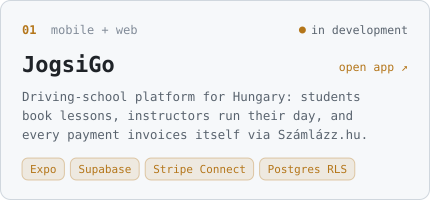
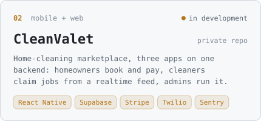
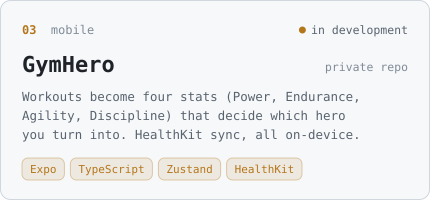
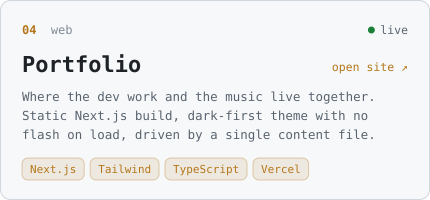

<picture>
  <source media="(prefers-color-scheme: dark)" srcset="./assets/header-dark.svg">
  
</picture>

  
  
  

I build mobile and web products end to end: the database, the auth, the payments, and the screens on top of them. Most of my work lives in private repos, so here is what it is.

## Currently building

<a href="https://jogsigo.expo.app"><picture><source media="(prefers-color-scheme: dark)" srcset="./assets/jogsigo-dark.svg"></picture></a>
<a href="https://ervin-nyisztor-portfolio.vercel.app"><picture><source media="(prefers-color-scheme: dark)" srcset="./assets/cleanvalet-dark.svg"></picture></a>
<picture><source media="(prefers-color-scheme: dark)" srcset="./assets/gymhero-dark.svg"></picture>
<a href="https://ervin-nyisztor-portfolio.vercel.app"><picture><source media="(prefers-color-scheme: dark)" srcset="./assets/portfolio-dark.svg"></picture></a>

## Stack

<picture>
  <source media="(prefers-color-scheme: dark)" srcset="https://skillicons.dev/icons?i=ts%2Creact%2Cnextjs%2Ctailwind%2Cnodejs%2Cdeno%2Csupabase%2Cpostgres%2Cpython%2Cvercel%2Cgit&theme=dark">
  
</picture>

**Apps** TypeScript · React Native / Expo · Next.js · Tailwind 
**Backend** Supabase · PostgreSQL · Edge Functions (Deno) · Stripe Connect 
**Before that** Python: Discord bots and tools, like [Dodmail](https://github.com/Erwin-afk/Dodmail)

## How I build

- **Security lives in the database.** Row-level security, with every write going through a security-definer function instead of trusting the client.
- **Secrets never ship in the app.** Payment keys stay server-side in Edge Functions; each customer's own invoicing key is encrypted in Supabase Vault.
- **Tests run anywhere.** Database tests on PGlite, so no Docker needed, and Edge Function tests on Deno.
- **Typed end to end.** TypeScript from the screens down to the Edge Functions, with database types generated from the schema.

## Off the keyboard

I produce music as **Fenzi**: [Spotify](https://open.spotify.com/artist/13ZWncwtfgIAqEkS2cvF8z) · [YouTube](https://www.youtube.com/@prodfenzi)
